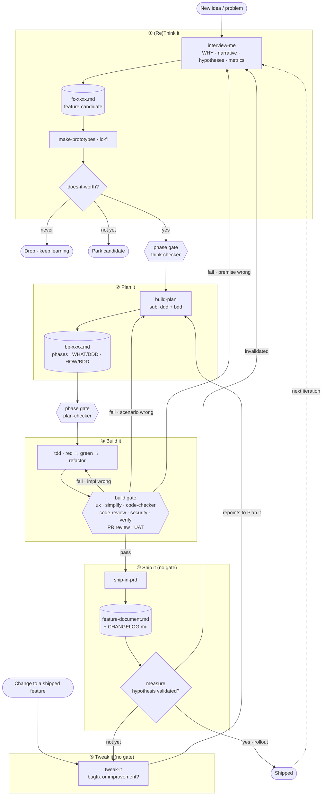

# Build Loop

(Re)Think it --> Plan it --> Build it --> Ship it. Loop again.

### Skills map

| Skill | Change | Notes |
|---|---|---|
| interview-me | New | "never guess, always ask" discipline |
| make-prototypes | New | lo-fi UX prototypes |
| does-it-worth | New | filters prototypes → yes / not yet / never |
| build-plan | New | orchestrates ddd + bdd; full or lite |
| ddd | Renamed (from ddd-refine) | sub-invoked by build-plan |
| bdd | New | sub-invoked by build-plan |
| tdd | Renamed (from implement) | executes build plan step by step; owns red → green → refactor |
| ship-in-prd | Repurposed (from promote) | every feature in prd MUST pass quality gates + have e2e tests |
| measure | New | hypotheses flow; closes the hyp-loop |
| tweak-it | New | bugfix or improvement; picks build-plan full/lite |
| log | Improved | table format, WHO changed WHAT ≤280 chars; called on every skill/agent mod; off-mermaid (touches every edge) |
| simplify · code-review · security-review · verify | Built-in (CLAUDE) | used as-is in the build gate |
| audit · create-doc | Remove | unused |

### Agents map

| Agent | Change | Notes |
|---|---|---|
| think-checker | New | gate ① → ②; validates fc-xxxx |
| plan-checker | Renamed (from doc-validator) + simplify | gate ② → ③; validates bp-xxxx (DDD/BDD/acceptance) |
| code-checker | Simplify | build gate |
| ux-checker | Simplify | build gate (optional, UI diffs) |
| test-writer | Remove | unused; tdd owns RED now |

### Docs map

| Doc | Change | Notes |
|---|---|---|
| fc-xxxx.md | New | feature candidate (hypotheses = a section here) |
| bp-xxxx.md | New | feature build plan |
| feature-document.md | Renamed (from cnst-xxxx) | living doc; minimal per-tweak updates (e.g. signals.md, alerts.md, radar.md) |
| CHANGELOG.md | New | — |
| epic-xxxx.md · fix-xxxx.md · hyp-xxxx.md | Remove | epics/fixes unused; hypotheses live inside fc-xxxx |

Docs lifecycle
- fc-xxxx and bp-xxxx are **working docs** (transient) — archived after ship.
- feature-document.md is the **living doc** — receives hypotheses + metrics distilled from the working docs, so `measure` has something to read.
- No `cnst` doc: invariants are guarded by e2e tests and declared in a feature-document "Invariants (e2e-guarded)" section.

## Loop overview

## (Re)Think it

- SKILL interview-me [YAGNI, KISS, DRY]
    - Questions loop:
        - WHAT you want to build and WHY?
        - What is the narrative that will make this loveable?
        - Which are the hypothesis for it?
        - Which metrics would help us decide if is it getting success?
    - Outcome: feature-candidate.md

- SKILL make-prototypes
    - Outcome: UX prototypes (lo-fi)

- SKILL does-it-worth [YAGNI, KISS, DRY]
    - Questions loop:
        - Does it worth to be build? (for each prototype)
        - Which prototypes best convey the narrative?
    - Outcome: feature-candidate.md (yes, not yet or never)

- phase gate
    - AGENT think-checker
        - WHAT/WHY + fc has narrative + hypotheses + metrics, prototype(s) exists and had been filtered, does-it-worth decision == "yes"

## Plan it

- SKILL build-plan [YAGNI, KISS, DRY]
    - Full or lite (lite comes from tweak-it and targets to be thin and fast)
    - Outcome: feature-build-plan.md
        - phases, steps, tasks
        - WHAT we must build [invokes /ddd]
        - HOW system must behave (acceptance criteria) [invokes /bdd]

- SKILL ddd
    - Outcome: feature-build-plan.md
        - WHAT we must build
        - Ubiquitous Language

- SKILL bdd
    - Outcome: feature-build-plan.md
        - HOW system must behave: acceptance criteria (integration, e2e tests in doc table form)
        - bdd scenarios (old AGENTS.md: 4.1 BDD scenario format - but in a table format)

- phase gate
    - AGENT plan-checker
        - Validates bp-xxxx (DDD/BDD/acceptance), all phases/steps/tasks unfolded into minimum for each task

## Build it

- SKILL tdd
    - Outcome: tests, code

- phase gate (build gate) IS the sequence below:
        1. AGENT ux-checker (optional)
        2. SKILL simplify
        3. AGENT code-checker
        4. SKILL code-review
        5. SKILL security-review
        6. SKILL verify
        7. PR review
        8. UAT
    - On fail, bounce to the phase that owns the defect:
        - impl wrong (right scenario) → Build it (back to tdd)
        - scenario wrong (mis-modeled HOW) → Plan it (back to build-plan)
        - premise wrong (WHAT/WHY off) → (Re)Think it (back to interview-me)

## Ship it

- SKILL ship-in-prd
    - Questions loop:
        - What changed? Which kind of change? [CHANGELOG.md]
        - Behaviors or rules we must keep working [acceptance criteria (unit, integration, e2e tests)]
        - Which are strict techinical information we must know about this?
    - Outcome: feature-document.md, CHANGELOG.md

- SKILL measure
    - Are hypothesis validated or not?
    - Outcome: Good enough for full rollout? yes, not yet or never (feature-document.md) + invokes tweak-it (optional)

- SKILL tweak-it
    - bugfix or improvement?
    - Outcome: tests, code, update docs (feature-document.md), invokes /build-plan (options full or lite)
    - Default LITE, escalate to FULL on an explicit scope trigger (a short checklist tweak-it runs, AI-assisted but rule-anchored):
        - FULL if any: touches a constant/contract, crosses a component boundary (new integration/e2e scenarios), changes the data model, or moves a hypothesis/metric.
        - else LITE (bugfix or local improvement).
