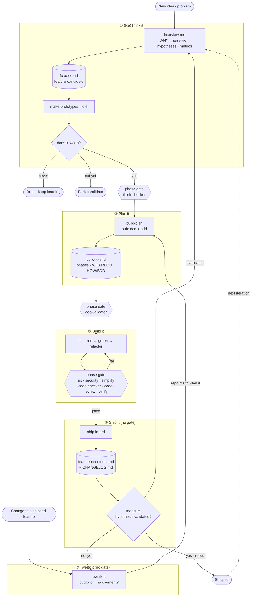

# Build Loop

(Re)Think it --> Plan it --> Build it --> Ship it. Loop again.

Skills map
- audit <!-- ✦ TRIM, unused, remove -->
- create-doc <!-- ✦ TRIM, unused, remove -->
- ddd-refine <!-- ↪ MAPS rename "ddd", sub-invoked by build-plan -->
- implement <!-- ↪ MAPS rename "tdd", only executes build plan stepy by step using TDD, nothing more. Owns green, red, refactor loop. -->
- log <!-- ↪ MAPS improved, changed to write in new docs and better format (table) and WHO changed WHAT in max. 280 chars. Called by every skill or agent mod. Not drawn in the mermaid on purpose; it would touch every edge. -->
- promote <!-- ↪ MAPS REPURPOSE "ship-in-prd" every feature bringed in prd MUST pass on quality gates, have e2e tests -->
- interview-me <!-- ✦ NEW never guess, always ask" discipline -->
- bdd <!-- ✦ NEW, sub-invoked by build-plan -->
- build-plan <!-- ✦ NEW -->
- measure <!-- ↪ MAPS to the hypotheses flow and closes hyp-loop -->
- make-prototypes <!-- ✦ NEW -->
- does-it-worth <!-- ✦ NEW -->
- tweak-it <!-- ✦ NEW -->
- simplify (CLAUDE)
- code-review (CLAUDE)
- security-review (CLAUDE)
- verify (CLAUDE)

Agents map
- think-checker <!-- ✦ NEW -->
- doc-validator <!-- ✦  ↪ MAPS rename "plan-checker" + make it simple on bp-xxxx (build-plan) -->
- code-checker  <!-- ✦ TRIM make it simple -->
- test-writer <!-- ✦ TRIM, unused, remove -->
- ux-checker  <!-- ✦ TRIM make it simple -->

Docs map
- epic-xxxx.md <!-- ✦ TRIM, unused, remove -->
- fix-xxxx.md <!-- ✦ TRIM, unused, remove -->
- cnst-xxxx.md <!-- ↪ MAPS rename "feature-document.md" e.g.: signals.md, alerts.md, radar.md, backtest.md. My main idea about this is a "living" doc: every tweak in a feature must update the feature document itself as minimal as possible - no dead docs or infinitely docs list that never get read (KISS, DRY). -->
- hyp-xxxx.md  <!-- TRIM, unused, remove: hypotheses are a SECTION inside fc-xxxx -->
- fc-xxxx.md <!-- ✦ NEW feature candidate -->
- bp-xxxx.md <!-- ✦ NEW feature-build-plan -->
- CHANGELOG.md <!-- ✦ NEW -->

## Loop overview

## (Re)Think it

- SKILL interview-me [YAGNI, KISS, DRY]
    - Questions loop:
        - WHAT you want to build and WHY?
        - What is the narrative that will make this loveable?
        - Which are the hypothesis for it?
        - Which metrics would help us decide if is it getting success?
    - Outcome: feature-candidate.md

- SKILL make-prototypes
    - Outcome: UX prototypes (lo-fi)

- SKILL does-it-worth [YAGNI, KISS, DRY]
    - Questions loop:
        - Does it worth to be build? (for each prototype)
        - Which prototypes best convey the narrative?
    - Outcome: feature-candidate.md (yes, not yet or never)

- phase gate
    - AGENT think-checker
        - WHAT/WHY + fc has narrative + hypotheses + metrics, prototype(s) exists and had been filtered, does-it-worth decision == "yes"

## Plan it

- SKILL build-plan [YAGNI, KISS, DRY]
    - Full or lite (lite comes from tweak-it and targets to be thin and fast)
    - Outcome: feature-build-plan.md
        - phases, steps, tasks
        - WHAT we must build [invokes /ddd]
        - HOW system must behave (acceptance criteria) [invokes /bdd]

- SKILL ddd
    - Outcome: feature-build-plan.md
        - WHAT we must build
        - Ubiquitous Language

- SKILL bdd
    - Outcome: feature-build-plan.md
        - HOW system must behave: acceptance criteria (integration, e2e tests in doc table form)
        - bdd scenarios (old AGENTS.md: 4.1 BDD scenario format - but in a table format)

- phase gate
    - AGENT plan-checker
        - Validates bp-xxxx (DDD/BDD/acceptance), all phases/steps/tasks unfolded into minimum for each task

## Build it

- SKILL tdd
    - Outcome: tests, code

- phase gate (build gate) IS the sequence below:
        1. AGENT ux-checker (optional)
        2. SKILL simplify
        3. AGENT code-checker
        4. SKILL code-review
        5. SKILL security-review
        6. SKILL verify
        7. PR review
        8. UAT

## Ship it

- SKILL ship-in-prd
    - Questions loop:
        - What changed? Which kind of change? [CHANGELOG.md]
        - Behaviors or rules we must keep working [acceptance criteria (unit, integration, e2e tests)]
        - Which are strict techinical information we must know about this?
    - Outcome: feature-document.md, CHANGELOG.md

- SKILL measure
    - Are hypothesis validated or not?
    - Outcome: Good enough for full rollout? yes, not yet or never (feature-document.md) + invokes tweak-it (optional)

- SKILL tweak-it
    - bugfix or improvement?
    - Outcome: tests, code, update docs (feature-document.md), invokes /build-plan (options full or lite)
    - Default LITE, escalate to FULL on an explicit scope trigger (a short checklist tweak-it runs, AI-assisted but rule-anchored):
        - FULL if any: touches a constant/contract, crosses a component boundary (new integration/e2e scenarios), changes the data model, or moves a hypothesis/metric.
        - else LITE (bugfix or local improvement).

## Claude round — 4 gaps that need your call

These aren't naming nits (I fixed those inline); they're real design forks I shouldn't pick for you.

1. **Where does human UAT live now?** Old AGENTS.md puts `/verify` at 6→7 as human-in-the-loop UAT. The new loop folds `verify` into the *automated* build gate (③) and marks Ship "no gate". So either (a) the build gate now contains the human UAT touch, or (b) human acceptance moved to Ship and `verify` here is just an automated smoke. Pick one — it changes whether ③→④ is fully automatable.
A: I put PR Review + UAT as new steps in build it gate.

2. **Doc lifecycle: fc → bp → feature-document.** Three docs across the loop. My read: `fc-xxxx` (Think) and `bp-xxxx` (Plan/Build) are *working docs*, distilled into the *living* `feature-document.md` at Ship — and the hypotheses+metrics defined in `fc` must carry through so `measure` can close them. Confirm fc/bp are transient (archived after ship) vs. also living. If the hypotheses don't travel, `measure` has nothing to read.
A: Yes let's follow your call: fc-xxxx and bp-xxxx are working docs (transient) and feature-document "living" that receive hypotheses and metrics from working docs.

3. **The "constant / platform truth" concept is being dropped.** `cnst-xxxx` is renamed to `feature-document.md`, but a constant (a truth the system must never accidentally break, e2e-guarded) is a *different idea* from a living feature doc. Renaming collapses the two. Intended? If yes, the loop loses its anti-regression anchor — worth a deliberate "we don't need constants" call, not a side effect of a rename.
A: Intended. Our e2e tests will guarantee that our invariant from each feature will keep working.

4. **`test-writer` removed → who owns RED?** Marked TRIM/remove, which means the `tdd` skill now authors its own failing tests. Fine, but AGENTS.md §4.2/§4.5 lean on `test-writer` for the RED step — confirm `tdd` absorbs that responsibility so the red-first discipline still has an owner.
A: Did it in skills map.