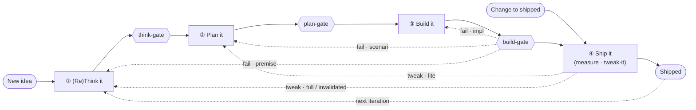
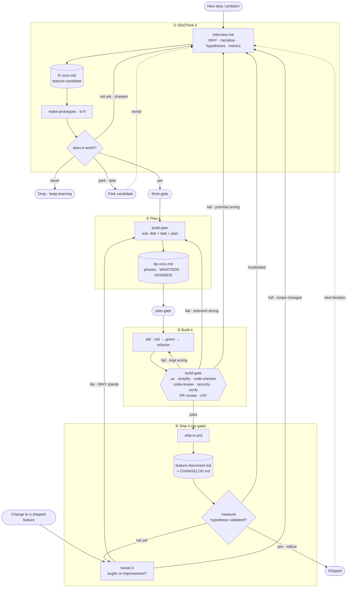

# Build Loop

(Re)Think it --> Plan it --> Build it --> Ship it. Loop again.

## Skills map

| Skill | Change | Notes |
|---|---|---|
| interview-me | New | "never guess, always ask" discipline |
| make-prototypes | New | lo-fi UX prototypes |
| does-it-worth | New | filters prototypes → yes / not yet / park / never |
| build-plan | New | orchestrates ddd + bdd + plan; full or lite |
| ddd | Renamed (from ddd-refine) | sub-invoked by build-plan |
| bdd | New | sub-invoked by build-plan |
| tdd | Renamed (from implement) | executes build plan step by step; owns red → green → refactor |
| ship-in-prd | Repurposed (from promote) | every feature in prd MUST pass quality gates + have e2e tests |
| measure | New | hypotheses flow; closes the hyp-loop |
| tweak-it | New | bugfix or improvement; picks build-plan full/lite |
| log | Improved | table format, WHO changed WHAT ≤280 chars; called on every skill/agent mod; off-mermaid (touches every edge) |
| simplify · code-review · security-review · verify | Built-in (CLAUDE) | used as-is in the build-gate |
| audit · create-doc | Remove | unused |

## Agents map

| Agent | Change | Notes |
|---|---|---|
| think-gate | New | gate ① → ②; validates fc-xxxx |
| plan-gate | Renamed (from doc-validator) + simplify | gate ② → ③; validates bp-xxxx (DDD/BDD/acceptance) |
| plan | Built-in (CLAUDE agent) | architect sub of build-plan — phases/steps/tasks, critical files, trade-offs |
| code-checker | Simplify | build-gate |
| ux-checker | Simplify | build-gate (optional, UI diffs) |
| test-writer | Remove | unused; tdd owns RED now |

## Docs map

| Doc | Change | Notes |
|---|---|---|
| fc-xxxx.md | New | feature candidate (hypotheses = a section here) |
| bp-xxxx.md | New | feature build plan |
| feature-document.md | Renamed (from cnst-xxxx) | living doc; minimal per-tweak updates (e.g. signals.md, alerts.md, radar.md) |
| CHANGELOG.md | New | — |
| epic-xxxx.md · fix-xxxx.md · hyp-xxxx.md | Remove | epics/fixes unused; hypotheses live inside fc-xxxx |

## Docs lifecycle
- fc-xxxx and bp-xxxx are **working docs** (transient); the loop archives them after ship.
- feature-document.md is the **living doc**. ship distills hypotheses + metrics from the working docs into it, so `measure` has something to read.
- No `cnst` doc: e2e tests guard the invariants, and a feature-document "Invariants (e2e-guarded)" section declares them.

## Design rules

- **Skills run in isolation.** A skill derives its context from the doc/repo state in front of it, never from what ran before it this session. You can invoke every skill and agent on its own.
- **Skills are free; gates are strict.** Gates enforce the loop, not a fixed skill order: a gate refuses to advance a doc until that phase's artifacts exist and validate. Gates check *state* (artifacts present + valid), never *history* (which skill ran). So isolated use and the guaranteed loop coexist. (Exception: TDD red-first is history-based, audited in git tags; it bites only at the build-gate.)
- **State lives in the log table.** The log table inside each doc is the single source of truth for "where are we," with no separate `Status:` field (it would only drift). Dropping the field removes the old AGENTS.md §4.8 status-vs-log sync hook.
    - **Two row kinds.** Most rows are intra-phase *work*; *transition* rows carry a `phase →`. **Current phase = the `phase →` of the most recent transition row.**

      | when | who | phase → | what (≤280) |
      |---|---|---|---|
      | … | tdd | — | green: snapshot writer |
      | … | plan-gate · skill advances | Plan it → Build it | gate passed |

    - **Append-only, single writer.** Only the log skill writes the table, and it appends, newest at bottom. That discipline makes "last row = state" trustworthy.
    - **Gates trigger, never write.** Gates stay read-only validators; on pass, the advancing skill (or Claude) calls log to append the transition row.
    - **No top-of-doc cache.** Derive the phase from the log (max-KISS).
    - **Lifecycle of the log.** Full history lives in `fc-xxxx` / `bp-xxxx` (die on archive after ship). `feature-document.md` keeps only the **last transition**; change history goes to `CHANGELOG.md`.
- **The build-gate mixes automated and human steps.** Of its 8 steps (see Build it), 1–6 run automated and 7–8 (PR review · UAT) need human sign-off, so ③ → ④ stops short of full automation by design. PR review and UAT are process steps, not skills or agents, so the maps omit them.
- **Claude-only for now (YAGNI).** This tool targets Claude. Built-in Claude skills and agents (`simplify`, `code-review`, `security-review`, `verify`, and the `plan` agent) couple in directly, with no abstraction layer. Add an AI-agnostic layer later if a second target ever lands.

## Skill contracts

Each skill declares **Requires / Produces / Standalone fallback**. Requires is a precondition on *state* (artifact present + phase read from the log), never "skill X ran first." The skills sequence themselves because one skill's Requires is another's Produces; neither names the other.

| Skill | Requires (state) | Produces | Standalone fallback |
|---|---|---|---|
| interview-me | — (entry); or an existing fc to re-sharpen | fc-xxxx (WHY · narrative · hypotheses · metrics) | works anywhere; creates a new fc |
| make-prototypes | fc-xxxx exists | lo-fi prototypes in fc | asks for / stubs a minimal fc |
| does-it-worth | fc-xxxx + prototypes present | verdict in fc (yes / not yet / park / never) | refuses; names what's missing |
| build-plan | fc-xxxx past think-gate (phase ②); or lite entry from tweak-it | bp-xxxx (phases · WHAT/DDD · HOW/BDD) | runs on a given fc; flags if gate not passed |
| ddd | bp-xxxx (or invoked by build-plan) | WHAT + ubiquitous language in bp | operates on the doc handed to it |
| bdd | bp-xxxx (or invoked by build-plan) | acceptance criteria + BDD scenarios (table) in bp | operates on the doc handed to it |
| plan (CLAUDE agent) | bp-xxxx (or invoked by build-plan) | phases/steps/tasks + critical files + trade-offs in bp | operates on the doc handed to it |
| tdd | bp-xxxx past plan-gate (phase ③) | tests + code (red→green→refactor commits) | runs on a given file, ungated |
| simplify · code-review · security-review · verify | a diff (verify also needs running app + bp scenarios) | cleanups / findings / UAT verdict | run on any diff |
| ship-in-prd | build-gate green (per log) | feature-document.md + CHANGELOG.md | refuses; names the missing gate |
| measure | feature-document w/ hypotheses + metrics + **live prod data** | rollout verdict (yes / not yet / invalidated) | refuses if no metrics defined |
| tweak-it | a shipped feature-document | full/lite build-plan invocation (sets re-entry phase) | operates on the named feature |
| log | a doc (creates the log table if missing) | appended row (work or transition) | creates the table |

**Gate contracts** (agents — read-only; on pass, the advancing skill writes the transition row):

| Gate | Requires | Emits |
|---|---|---|
| think-gate | fc complete: narrative + hypotheses + metrics, prototype(s) filtered, does-it-worth = yes | ① → ② |
| plan-gate | bp valid: DDD + BDD/acceptance, every phase/step/task unfolded to its minimum | ② → ③ |
| build-gate | tdd outputs clean across the 8-step sequence | ③ → ④ (else bounce: impl→③ · scenario→② · premise→①) |

**Completeness check: two Requires that nothing else Produces (external inputs, by design):**
- `measure` needs **live prod data** — comes from telemetry on the shipped cohort, not from any doc.
- `ship-in-prd` needs the **deploy + feature-flag** mechanism (CI/CD GitHub→EC2, release-by-flag) — infra, not a skill output. (See Ship it.)

Everything else chains: an upstream Produces satisfies each skill's Requires.

## Loop overview (phases + gates)

## Loop detail

## (Re)Think it

- SKILL interview-me [YAGNI, KISS, DRY]
    - Questions loop:
        - WHAT you want to build and WHY?
        - What narrative makes it lovable?
        - What are the hypotheses?
        - Which metrics tell us it's succeeding?
    - Outcome: fc-xxxx.md

- SKILL make-prototypes
    - Outcome: UX prototypes (lo-fi)

- SKILL does-it-worth [YAGNI, KISS, DRY]
    - Questions loop:
        - Is it worth building? (per prototype)
        - Which prototypes best convey the narrative?
    - Outcome: fc-xxxx.md — one of:
        - yes → think-gate
        - not yet → reloop to interview-me (sharpen WHY/narrative/hypotheses)
        - park → shelve, revisit via interview-me later
        - never → drop, keep learning

- GATE think-gate — fc complete + does-it-worth = yes

## Plan it

- SKILL build-plan [YAGNI, KISS, DRY]
    - Full or lite (lite comes from tweak-it and targets to be thin and fast)
    - Outcome: bp-xxxx.md
        - phases, steps, tasks [invokes plan agent]
        - WHAT we must build [invokes /ddd]
        - HOW system must behave (acceptance criteria) [invokes /bdd]

- AGENT plan (CLAUDE)
    - Outcome: bp-xxxx.md
        - phases, steps, tasks (decomposition), critical files, trade-offs

- SKILL ddd
    - Outcome: bp-xxxx.md
        - WHAT we must build
        - Ubiquitous Language

- SKILL bdd
    - Outcome: bp-xxxx.md
        - HOW system must behave: acceptance criteria (integration, e2e tests in doc table form)
        - bdd scenarios (old AGENTS.md §4.1 format, as a table)

- GATE plan-gate — bp valid (DDD + BDD + every task unfolded)

## Build it

- SKILL tdd
    - Outcome: tests, code

- GATE build-gate — runs in order:
    1. AGENT ux-checker (optional)
    2. SKILL simplify
    3. AGENT code-checker
    4. SKILL code-review
    5. SKILL security-review
    6. SKILL verify
    7. PR review
    8. UAT
    - On fail, bounce to the phase that owns the defect:
        - impl wrong (right scenario) → Build it (back to tdd)
        - scenario wrong (mis-modeled HOW) → Plan it (back to build-plan)
        - premise wrong (WHAT/WHY off) → (Re)Think it (back to interview-me)

## Ship it

- SKILL ship-in-prd
    - Questions loop:
        - What changed? Which kind of change? [CHANGELOG.md]
        - Behaviors or rules we must keep working [acceptance criteria (unit, integration, e2e tests)]
        - Which are strict techinical information we must know about this?
    - Outcome: feature-document.md, CHANGELOG.md
    - **Deploy ≠ release** is the seam. ship-in-prd does both, as separate acts:
        - **Deploy** (artifact reaches the box): CI/CD, all-or-nothing. GitHub Actions on merge → main: build, then deliver to EC2 via AWS SSM Run Command (no inbound SSH) or rsync/SSH; restart via systemd / docker compose. The code is on the box or it isn't.
        - **Release** (who sees it): a feature flag / cohort gate in the app, not infra. A single EC2 can't split traffic without an ALB + 2 target groups → YAGNI now. ship-in-prd sets the flag to a small launch cohort and records the flag name + cohort in feature-document.md.
        - Full rollout (measure = yes) = flip the flag to 100%. Rollback = flip to 0%, no redeploy.
        - Infra canary (ALB weighted target groups / CodeDeploy blue-green) is a future change, only if a flag stops being enough.

- SKILL measure
    - Are the hypotheses validated?
    - Outcome: Good enough for full rollout? yes, not yet, or invalidated (feature-document.md) + invokes tweak-it (optional)
    - **Telemetry seam.** measure needs live prod data, which no skill produces. The chain that supplies it:
        - Metrics + success threshold are defined in interview-me (fc-xxxx) — the "which metrics tell us success" question.
        - They travel into feature-document.md at ship (distilled from fc-xxxx).
        - Build it instruments them: each metric maps to an event/counter the running app emits; a bdd acceptance line can pin "emits metric X" so instrumentation ships with the feature, not bolted on later.
        - ship-in-prd's release flag tags the cohort, so metric values are attributable to the launched cohort vs baseline.
        - measure reads the cohort's values from the telemetry sink [PROJECT: dashboard / query / metrics store] and compares to the threshold from fc-xxxx.
        - yes → threshold met (flip flag to 100%) · not yet → inconclusive (tweak-it) · invalidated → threshold clearly missed (re-think).
    - Closes the hyp-loop: hypothesis + metric defined in ①, instrumented in ③, released to a cohort in ④, judged here in ④.

- SKILL tweak-it
    - bugfix or improvement?
    - Outcome: tests, code, update docs (feature-document.md), invokes /build-plan (options full or lite)
    - Default LITE, escalate to FULL on an explicit scope trigger (a short checklist tweak-it runs, AI-assisted but rule-anchored):
        - FULL if any: touches a constant/contract, crosses a component boundary (new integration/e2e scenarios), changes the data model, or moves a hypothesis/metric.
        - else LITE (bugfix or local improvement).
    - Full vs lite = **where you re-enter the loop**:
        - LITE → re-enters at Plan it (thin build-plan; WHY/narrative unchanged)
        - FULL → re-enters at (Re)Think it (premise/scope moved; re-interview → re-worth → full build-plan)
