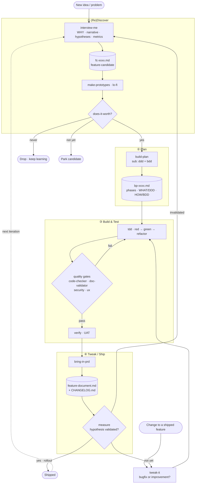

# Build Loop

We default load: BDD, DDD, DRY, Harness engineering, KISS, SDD, TDD, YAGNI

Skills map
- audit <!-- ✦ TRIM, unused, remove -->
- create-doc <!-- ✦ TRIM, unused, remove -->
- ddd-refine <!-- ↪ MAPS rename "ddd", sub-invoked by build-plan -->
- implement <!-- ↪ MAPS rename "tdd", only executes build plan stepy by step using TDD, nothing more -->
- log <!-- ↪ MAPS improved, changed to write in new docs and better format (table) and WHO changed WHAT in max. 280 chars -->
- promote <!-- ↪ MAPS rename "bring-in-prd" --> <!-- ◆ Q: this is a REPURPOSE, not a rename. promote moved a constant Proposed→Active once an e2e test existed; bring-in-prd captures "what changed / behaviors to keep / CHANGELOG". Different job. -->
- interview-me <!-- ✦ NEW -->
- bdd <!-- ✦ NEW, sub-invoked by build-plan --> <!-- ◆ Q: appears in the map but never in the flow below (only as a "[BDD]" tag). If it's a real sub-skill, show it in Plan. -->
- build-plan <!-- ✦ NEW -->
- measure <!-- ↪ MAPS to the hypotheses flow and closes hyp-loop -->
<!-- ◆ Q: make-prototypes, does-it-worth, tweak-it appear in the flow below but are MISSING from this map. Add them, or they aren't skills. -->
<!-- ◆ Q (ddd-refine→"ddd"): old ddd-refine was the Status-2 anti-assumption guardian (every ambiguity → a question, never a guess). If it's now just a build-plan sub-step, decide whether that "never guess, always ask" discipline survives or gets diluted. -->
- simplify (CLAUDE) <!-- TBD -->
- code-review (CLAUDE) <!-- TBD -->
- verify (CLAUDE) <!-- TBD -->

Agents map <!-- ◆ Q: all four are "TBD" AND the Build & Test phase below doesn't mention gates. Decide if the gate layer survives; if so, anchor it to the bp build phase (not a status number). -->
- code-checker  <!-- TBD -->
- doc-validator <!-- TBD --> <!-- ◆ Q: it gated the old 2→3 "ready for backlog". What does it validate now — fc-xxxx (candidate) or bp-xxxx (build-plan)? -->
- test-writer <!-- ✦ TRIM, unused, remove --> <!-- ◆ note: with this gone, the "tdd" skill itself owns red→green→refactor inline. Good (KISS). -->
- security-reviewer (CLAUDE) <!-- TBD -->
- ux-checker <!-- TBD -->

Docs map
- epic-xxxx.md <!-- ✦ TRIM, unused, remove -->
- fix-xxxx.md <!-- ✦ TRIM, unused, remove --> <!-- ◆ Q: bugfixes lose their own doc kind. They enter at Tweak (tweak-it). Confirm they still route through tdd (failing test first), not a side-door that skips red. -->
- cnst-xxxx.md <!-- ↪ MAPS rename "feature-document.md" e.g.: signals.md, alerts.md, radar.md, backtest.md --> <!-- ◆ Q (the big one): a constant had teeth — e2e tests + a gate that REJECTED any epic breaking it. If invariants become prose bullets in signals.md, what stops a future tweak-it from silently breaking them? Decide: is feature-document.md just living docs, or the invariant registry with e2e backing + a guard? I'd keep the guard. -->
- hyp-xxxx.md  <!-- TBD --> <!-- ◆ Q: interview-me captures hypotheses but outputs fc-xxxx.md, not hyp-xxxx.md. Pick one: hypotheses are a SECTION inside fc-xxxx (simpler, my lean), or standalone hyp docs (then define who creates them + how measure resolves them). -->
- fc-xxxx.md <!-- ✦ NEW feature candidate -->
- bp-xxxx.md <!-- ✦ NEW feature-build-plan -->
- CHANGELOG.md <!-- ✦ NEW -->
<!-- ◆ Q (state): the old 8-status machine is gone — good — but the gates hung on status transitions. fc and bp each need a tiny lifecycle for gates to anchor to, e.g. fc: candidate→validated→planned ; bp: planned→built→shipped. -->

## Loop overview

<!-- Two entry points: new ideas enter at (Re)Discover; changes to shipped features enter at Tweak. The three feedback edges out of `measure` are what make it a loop. -->

## (Re)Discover

<!-- ◆ Q: the "(Re)" is the invalidated-hypothesis loop (measure → invalidated → interview-me). Make that re-entry arrow explicit when this becomes AGENTS.md. -->

- SKILL interview-me [YAGNI, KISS, DRY]
    - Questions loop:
        - WHAT you want to build and WHY?
        - What is the narrative that will make this loveable?
        - Which are the hypothesis for it?
        - Which metrics would help us decide if is it getting success?
    - Outcome: feature-candidate.md
- SKILL make-prototypes
    - Outcome: UX prototypes (lo-fi)
- SKILL does-it-worth [YAGNI, KISS, DRY]
    - Questions loop:
        - Does it worth to be build? (for each prototype)
        - Which prototypes best convey the narrative?
    - Outcome: feature-candidate.md (yes, not yet or never)

## Plan

- SKILL build-plan [YAGNI, KISS, DRY]
    - Outcome: feature-build-plan.md (replaces epic/bugfix docs)
        - phases, steps, tasks
        - WHAT we must build [DDD]
        - HOW system must behave (acceptance criteria) [BDD]

## Build & Test

<!-- ◆ Q: this phase is silent on the gate agents (code-checker, doc-validator, security-reviewer, ux-checker) and on /verify UAT. Decide where they fire — see the mermaid (gates after tdd, verify before ship). -->

- SKILL tdd [BDD, TDD]
    - Outcome: tests, code
    <!-- ◆ note: bdd (in Plan) authors the scenarios; tdd here implements them test-first. Spell out the handoff. tweak-it (bugfixes/improvements) routes through THIS skill too — no red-skipping side-door. -->

## Tweak

- SKILL bring-in-prd
    <!-- ◆ Q: "behaviors or rules we must keep working" = the old constants. Tie these to e2e tests + a guard, or the invariant protection is lost (see cnst-xxxx note above). -->
    - Questions loop:
        - What changed? Which kind of change? [CHANGELOG.md]
        - Which are the currently behaviors or rules we must keep working?
        - Which are strict techinical information we must know about this?
    - Outcome: feature-document.md, CHANGELOG.md

- SKILL measure
    - Questions loop:
        - Are hypothesis from discover validated or not?
        - Good enough for full rollout?
    - Outcome: yes, not yet or never (feature-document.md)

- SKILL tweak-it
    - bugfix or improvement?
    - Outcome: tests, code, update docs (feature-document.md), invokes /bring-in-prd
