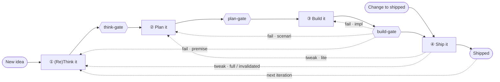

<!--
BuildLoop operating manual — TEMPLATE.

Drop this file at your repository root as `AGENTS.md` and adapt the bracketed
[PROJECT: …] notes to your stack. The buildloop plugin's skills and agents
reference this file by section number (e.g. "AGENTS.md §6.2"), so keep the
section numbering intact when you edit. Delete a section's content only if you
also remove the rule it encodes everywhere it is referenced.
-->

# Agent Instructions

This file is the canonical operating manual for this project. It is tool-agnostic — every agent, skill, and human contributor reads from here. `CLAUDE.md` at the root is a thin pointer to this file plus the few non-negotiables that must always load.

## 1. Where rules live

Three-layer convention for every rule in this file:

> **Declarative text lives in AGENTS.md. Operational enforcement lives in skills. Auditing lives in agents.**

- Change a rule → edit AGENTS.md.
- Change enforcement → edit a buildloop skill.
- Change auditing → edit an agent under `.claude/agents/` (or the plugin's bundled agents).

Each cross-cutting rule below is the single source of truth. Skills and agents that enforce or audit a rule **reference it by name** rather than restating it.

## 2. Product alignment

Before product, architecture, analytics, UI, or wording changes, check your project's product docs and keep changes aligned with them.

[PROJECT: list your product docs and the product rules every change must honor, e.g.

- `docs/about-us/vision.md`, `docs/about-us/principles.md`, `docs/about-us/architecture.md`
- one-line product rules: what the product is and is not, naming discipline, the bar you hold (correctness / explainability / stability) before scale.

`interview-me` and `ddd` read the product docs a candidate touches via this section, so name them here.]

## 3. The build loop

(Re)Think it → Plan it → Build it → Ship it. Loop again.

### 3.1 Phases and gates



- **New idea / problem** enters at ① via `interview-me`.
- **Change to a shipped feature** enters via `tweak-it`, which re-enters the loop at ② (lite) or ① (full).

### 3.2 State lives in the log table

There is no `Status:` field. Each doc carries a `## Log` table that is the single source of truth for "where are we."

- **Fixed four columns**: `when | who | phase → | what`.
- **Two row kinds.** A *work* row is intra-phase progress (`phase →` is `—`). A *transition* row carries `<From> → <To>`. **Current phase = the To-side of the most recent transition row.**
- **Append-only, single writer.** Only the `log` skill writes the table, newest at the bottom — which is what makes "last transition = state" trustworthy.
- **Gates trigger, never write.** A gate returns a verdict; on pass the advancing skill (or, for a standalone gate run, the user/Claude) calls `log` to append the transition row.
- **No top-of-doc cache.** Derive the phase from the log; `buildloop current-phase <doc>` does this deterministically.
- **Canonical phase tokens**: `① (Re)Think it · ② Plan it · ③ Build it · ④ Ship it`.

### 3.3 The phases

Each phase names the skills that run in it and the artifact it produces. Skills carry their own HOW; this section is the WHAT and WHY.

| Phase | Skills | Produces |
|---|---|---|
| **① (Re)Think it** | `interview-me` (WHY · narrative · hypotheses · metrics) → `make-prototypes` (lo-fi) → `does-it-worth` (verdict) | `fc-NNNN.md` |
| **② Plan it** | `build-plan` orchestrates `ddd` (WHAT) + `bdd` (HOW) + the `plan` agent (decomposition) | `bp-NNNN.md` |
| **③ Build it** | `tdd` (red → green → refactor) → `build-gate` (§3.8) | tests + code |
| **④ Ship it** | `ship-in-prd` (deploy + release) → `measure` (hypothesis verdict) → `tweak-it` (bugfix / improvement) | `feature-document.md` + `CHANGELOG.md` |

### 3.4 Gates

A gate is a **read-only verdict function of doc state** — never of which skill ran. Because it depends only on artifacts-present-and-valid and never writes, it works identically whether spawned by the advancing skill or invoked standalone (`/<gate> <doc>`); on pass, the write of the transition row is always the separate step owned by whoever advances.

**Already-past guard**: a gate first reads `buildloop current-phase`; if the doc is already past its phase, it returns a one-line "already at phase X" and skips the rubric.

| Gate | Kind | Requires | Emits |
|---|---|---|---|
| `think-gate` | agent (read-only) | fc complete (§6.2) | `① → ②` |
| `plan-gate` | agent (read-only) | bp valid (§6.3) | `② → ③` |
| `build-gate` | skill (orchestrator) | the 8-step sequence clean (§3.8) | `③ → ④`, else bounce |

**Build-gate bounce** routes a failure to the phase that owns the defect: implementation wrong → ③ (`tdd`); scenario mis-modeled → ② (`build-plan`); premise wrong → ① (`interview-me`).

### 3.5 Doc kinds and lifecycle

| Doc | Kind | Path | Role |
|---|---|---|---|
| `fc-NNNN.md` | feature candidate | `docs/buildloop/working/` | WHY · narrative · hypotheses · metrics · prototypes · verdict |
| `bp-NNNN.md` | build plan | `docs/buildloop/working/` | phases · WHAT/DDD · HOW/BDD · decomposition |
| `feature-document.md` | living doc | `docs/buildloop/living/` | one per feature; hypotheses + metrics + invariants + release |
| `CHANGELOG.md` | change history | repo root | WHO changed WHAT, newest first |

- **fc and bp are working (transient) docs.** They hold the full log until ship, then archive under `docs/buildloop/working/archive/`.
- **feature-document.md is the living doc.** `ship-in-prd` distills the fc + bp hypotheses, metrics, and invariants into it, so `measure` has something to read. It keeps only its **last transition**; change history goes to `CHANGELOG.md`.
- **No constants doc.** Invariants the system must uphold are declared in a feature-document's **"Invariants (e2e-guarded)"** section and guarded by e2e tests.

### 3.6 Skill contracts

Each skill declares **Requires (state) / Produces / Standalone fallback**. *Requires* is a precondition on state (artifact present + phase read from the log), never "skill X ran first." Skills sequence themselves because one skill's Requires is another's Produces; neither names the other.

| Skill | Requires (state) | Produces | Standalone fallback |
|---|---|---|---|
| `interview-me` | — (entry); or an existing fc to re-sharpen | fc (WHY · narrative · hypotheses · metrics) | works anywhere; creates a new fc |
| `make-prototypes` | fc exists | lo-fi prototypes in fc | asks for / stubs a minimal fc |
| `does-it-worth` | fc + prototypes present | verdict in fc | refuses; names what's missing |
| `build-plan` | fc past think-gate (②); or lite entry from tweak-it | bp (phases · WHAT · HOW) | runs on a given fc; flags if gate not passed |
| `ddd` | bp (or invoked by build-plan) | WHAT + ubiquitous language in bp | operates on the doc handed to it |
| `bdd` | bp (or invoked by build-plan) | acceptance scenarios (table) in bp | operates on the doc handed to it |
| `plan` (agent) | bp (or invoked by build-plan) | decomposition + critical files + trade-offs in bp | operates on the doc handed to it |
| `tdd` | bp past plan-gate (③) | tests + code (red→green→refactor) | runs on a given file, ungated |
| `simplify · code-review · security-review · verify` | a diff (verify also needs a running app + bp scenarios) | cleanups / findings / UAT verdict | run on any diff |
| `ship-in-prd` | build-gate green (per log) | feature-document + CHANGELOG | refuses; names the missing gate |
| `measure` | feature-document w/ hypotheses + metrics + **live prod data** | rollout verdict (yes / not yet / invalidated) | refuses if no metrics defined |
| `tweak-it` | a shipped feature-document | full/lite build-plan invocation (sets re-entry phase) | operates on the named feature |
| `log` | a doc (creates the `## Log` table if missing) | appended row (work or transition) | creates the table |

**Two Requires that nothing else Produces — external inputs, by design:**
- `measure` needs **live prod data** — from telemetry on the shipped cohort, not any doc (§4.10).
- `ship-in-prd` needs the **deploy + feature-flag** mechanism — infra, not a skill output (§4.9).

Everything else chains: an upstream Produces satisfies each Requires.

### 3.7 Auto-suggest at triage

When a user message describes building, fixing, or changing something, Claude proposes the entry skill before writing code — `interview-me` for a new idea, `tweak-it` for a change to a shipped feature. User confirms or redirects. No auto-firing; the explicit skill invocation is always available. Questions, exploration, and discussion do not trigger the suggestion.

### 3.8 Build-gate sequence

`build-gate` runs these in order; steps 1–6 are automated, 7–8 need human sign-off (so ③ → ④ stops short of full automation by design). PR review and UAT are process steps, not skills or agents.

1. `ux-checker` agent (optional — UI diffs only)
2. `/simplify`
3. `code-checker` agent
4. `/code-review`
5. `/security-review`
6. `/verify`
7. PR review
8. UAT

On fail, bounce per §3.4.

## 4. Cross-cutting rules

### 4.1 BDD scenario format

Acceptance scenarios live in the bp **HOW** section as table rows — one behavior per row:

| layer | scenario | given | when | then |
|---|---|---|---|---|
| `[unit \| integration \| e2e]` | one-line behavior name | single precondition | single action | single observable outcome |

- One Given, one When, one Then. No `And`, no `But`. Five behaviors → five rows.
- The **layer tag is mandatory**. `bdd` raises the layer question per behavior (does it cross component boundaries?). Invariant scenarios in a feature-document are always `[e2e]`.
- Strict format, no parser today — preserves the option to plug in a BDD runner later without rewriting docs.
- `plan-gate` rejects any row missing a layer tag or violating the one-of-each rule.

### 4.2 Test layers

| Layer | Source | Lives in | Written during | Audited by |
|---|---|---|---|---|
| Unit | bp scenarios tagged `[unit]` | `tests/unit/<area>/` | ③ `tdd` loop | `code-checker` |
| Integration | bp scenarios tagged `[integration]` | `tests/integration/` | ③, after unit | `code-checker` |
| E2E | feature-document invariants (always e2e) | `tests/e2e/` | when the invariant ships | `code-checker` coverage; `/verify` in the running app |

`code-checker` audits that every scenario has a test file in the layer matching its tag. [PROJECT: adjust test-directory paths to your layout if they differ.]

### 4.3 Test naming convention

Mandatory across all layers. The class / suite name transliterates the scenario's `Given / When`; the methods / cases correspond to the `Then`s — one assertion each. This gives grep-traceability between doc scenarios and code.

[PROJECT: pin the exact convention for your test framework(s). Examples:

**Python (pytest, class-based):**
```python
class TestSubject_WhenCondition:
    def test_should_expected_behavior(self): ...
```

**Node (node:test, describe/it):**
```js
describe('Subject when condition', () => {
  it('should expected behavior', () => { ... })
})
```
]

### 4.4 100% coverage + non-product files list

**Rule**: 100% line coverage on all source files. Audited by `code-checker` at the build-gate.

**Exclusions** — the **non-product files list**, single source of truth, reused for the doc-less commit exception (§5.1). [PROJECT: maintain this list for your repo. Typical entries:]

- config / manifest files (`.env*`, `*.cfg`, `pyproject.toml`, `package.json`)
- `.claude/settings.json`, `.claude/launch.json`
- deploy / ops config
- generated files (type stubs, build artifacts)
- thin CLI shims

**Thin CLI shim** = a file whose top-level code is only argument parsing + a single delegating call to library code. If logic creeps in, it crosses the line. Judgment call audited by `code-checker`.

### 4.5 TDD red-first

Non-negotiable. Owned operationally by `tdd`.

1. Write the failing test. Run it. **Observe RED** — failing for the right reason, not a setup or import error.
2. Write the minimum code to flip GREEN. Nothing more.
3. Refactor with all prior tests still GREEN.
4. Loop.

Locks:

- **One test at a time.** The cycle is per individual test, not per scenario or file. Writing five tests then code that flips them all at once violates TDD even if end-state coverage is identical.
- **One scenario typically unfolds into N tests** — each correctness condition gets its own assertion, each through its own red→green.
- **Scenarios are tackled sequentially.**
- Tests never seen RED don't count.

**Exemption — characterization testing of unchanged code.** A pure coverage-backfill that adds tests to *existing, unmodified* production code cannot observe a meaningful RED. Such a fix is characterization testing, not TDD, and is exempt from the per-test loop. It applies only when **no production code changes**. It must instead: (1) declare itself in the log; (2) drive the real red→green at the coverage-gate level (file moves `<100%` → `100%`); (3) prove each test bites via a mutation spot-check (break the line, confirm the test fails, revert).

`code-checker` audits for RED → GREEN evidence in commit history and the log — or, for a declared characterization fix, the coverage-gate red→green plus a recorded mutation spot-check.

### 4.6 DDD anti-assumption

`ddd` is the guardian of the WHAT (phase ②, within `build-plan`).

- Every ambiguity becomes a question, never a guess.
- "I think the user probably means…" is forbidden — ask instead.
- The skill MUST NOT let `build-plan` advance toward the plan-gate while any open question exists; it records the question in the doc instead.
- "Implicit requirements" don't exist in this skill's vocabulary. If it's not in the doc, it's not agreed.

`think-gate` and `plan-gate` both reject a doc carrying open questions.

### 4.7 Writing principles — DRY, KISS, YAGNI

Apply to every text surface — AI agents and humans alike, in buildloop docs, code comments, test names, commit messages, PR bodies, and agent self-checks:

- **DRY** — concise sentences. No redundancy, no over-explaining.
- **KISS** — simple solutions. Small, targeted changes that are easy to review.
- **YAGNI** — build only what today's task asks for. Preserve existing behavior unless the task is explicitly a behavior change. No broad refactors during localized fixes.

The think-gate and plan-gate enforce concrete style checks (§6.2 / §6.3). Humans judge the rest.

### 4.8 UX validation routing

UX validation is performed by a project-provided `ux-checker` agent (if your project has a UI), per its own routing rules — typically production-read mode for UI-only diffs, local-stack mode when the diff touches API, DB, or schema. This rule lives in that agent's definition. [PROJECT: add a `ux-checker` agent under `.claude/agents/` if you have user-facing surfaces; otherwise this section is inert.]

### 4.9 Deploy ≠ release

`ship-in-prd` does both, as separate acts:

- **Deploy** (artifact reaches the box): CI/CD, all-or-nothing. [PROJECT: name your pipeline, e.g. GitHub Actions on merge → main: build, deliver to the host, restart via systemd / docker compose.]
- **Release** (who sees it): a feature flag / cohort gate in the app, not infra. `ship-in-prd` sets the flag to a small launch cohort and records the flag name + cohort in the feature-document.
- Full rollout (`measure` = yes) = flip the flag to 100%. Rollback = flip to 0%, no redeploy.

[PROJECT: a single host can't split traffic without an LB + target groups — YAGNI until a flag stops being enough. Name your flag mechanism and any future canary plan here.]

### 4.10 Telemetry seam

`measure` needs live prod data, which no skill produces. The chain that supplies it:

- Metrics + success threshold are defined in `interview-me` (fc) — the "which metrics tell us success" question.
- They travel into the feature-document at ship (distilled from the fc).
- `tdd` instruments them: each metric maps to an event/counter the running app emits; a bdd acceptance row can pin "emits metric X" so instrumentation ships with the feature.
- `ship-in-prd`'s release flag tags the cohort, so values are attributable to the launched cohort vs baseline.
- `measure` reads the cohort's values from the telemetry sink [PROJECT: dashboard / query / metrics store] and compares to the threshold from the fc.

This closes the hypothesis loop: defined in ①, instrumented in ③, released to a cohort in ④, judged in ④.

## 5. Commits, PRs, sequence numbers

### 5.1 Commit message format

```
(<doc-id>): <short imperative description>
```

- ≤ 70 chars on the header line.
- `<doc-id>` ∈ `fc-NNNN` / `bp-NNNN`.
- Body optional (1–3 sentences on *why*).
- **Footer required on phase transitions**:
  ```
  Log: <doc-id> <From> → <To>
  ```
- **TDD cycle commits** inside phase ③ carry explicit tags in the description:
  ```
  (bp-0024): RED — snapshot row insertion fails for missing event
  (bp-0024): GREEN — write snapshot row for missing event
  (bp-0024): refactor — extract snapshot writer helper
  ```
  `code-checker` audits TDD discipline by greping for unpaired RED entries.

**Doc-less commit exceptions**:
- Commits touching only files in the **non-product files list** (§4.4).
- Commits touching only README or non-buildloop docs.

### 5.2 PR template

Lives at `.github/PULL_REQUEST_TEMPLATE.md`. Body:

```markdown
## Doc
- Plan: [bp-NNNN](docs/buildloop/working/bp-NNNN.md)
- Candidate: [fc-NNNN](docs/buildloop/working/fc-NNNN.md)

## Summary
<one paragraph: what changes from the user/system perspective>

## BDD scenarios delivered
- <scenario name 1>
- <scenario name 2>

## Log entry
Transition: <From> → <To>  (or "no transition; intra-phase work")
See `bp-NNNN.md` § Log → newest row.

## Quality gates
- [ ] `/simplify` clean
- [ ] `code-checker` clean
- [ ] `/code-review` clean
- [ ] `/security-review` clean
- [ ] `ux-checker` clean (or N/A — diff doesn't touch UI)
- [ ] `/verify` UAT pass (or pending — PR opens at build-gate, UAT happens before ④)

## Test plan for reviewer
- [ ] <thing for the human reviewer to verify>
```

**Lifecycle**: the PR opens when `build-gate` starts (handing off to automated review) with the UAT box unchecked. UAT happens on the PR branch. UAT pass + all boxes checked = merge = phase ④.

### 5.3 Sequence number scheme

`NNNN` = 4 digits, zero-padded, per kind (`fc-0001…`, `bp-0001…`). `buildloop next-id <fc|bp>` issues the next, reserving archived numbers. Expanding to 5 digits is a clean future change if a kind approaches 9999.

## 6. Skills and agents

### 6.1 Namespace

BuildLoop skills use the `buildloop:` namespace: `/buildloop:interview-me`, `make-prototypes`, `does-it-worth`, `build-plan`, `ddd`, `bdd`, `tdd`, `build-gate`, `ship-in-prd`, `measure`, `tweak-it`, `log`.

Agents: `think-gate`, `plan-gate`, `code-checker`, plus the project-provided `ux-checker`.

Built-ins couple in directly (Claude-only for now — YAGNI; add an AI-agnostic layer if a second target ever lands): `/simplify`, `/code-review`, `/security-review`, `/verify`, and the `plan` agent.

[PROJECT: add your own gate agents under `.claude/agents/` for the slots your stack needs — e.g. a project `security-reviewer` or the `ux-checker` (§4.8) — and name them here.]

### 6.2 think-gate criteria (① → ②)

The fc passes only when all are present and clean:

1. **Single headline** sentence at top, no "and".
2. **WHY** — the problem worth solving (not a restatement of the headline).
3. **Narrative** — what makes it lovable.
4. **Hypotheses** — at least one falsifiable claim.
5. **Metrics** — each hypothesis has a metric, a success threshold, and the event/counter that emits it.
6. **Prototype present and filtered** — at least one lo-fi prototype, weighed by `does-it-worth`.
7. **Verdict = yes.**
8. **No open questions.**
9. **No preamble, no echo** — no prose between H1 and the first `##` (one-line metadata like `Candidate:` is fine); no section that merely repeats its title.

Returns pass/fail + a concrete gap list per failed criterion.

### 6.3 plan-gate criteria (② → ③)

The bp passes only when all are present and clean:

1. **WHAT (DDD)** — domain models, rules, services, and a ubiquitous-language table.
2. **HOW (BDD)** — acceptance scenarios as table rows in strict format (§4.1), every row layer-tagged.
3. **Decomposition unfolded** — every phase/step/task small enough to implement directly; nothing left as a vague lump.
4. **Candidate linked** — the bp links its fc, and the fc is past the think-gate.
5. **Invariant-conflict check** — if the bp's scope would break a feature-document's e2e-guarded invariant, it MUST list "supersedes <invariant>" in its deliverables, or be redesigned not to break it.
6. **No open questions.**
7. **No preamble, no echo** (as §6.2 criterion 9).

Returns pass/fail + a concrete gap list per failed criterion. `plan-gate` folds in a `/simplify` pass over the doc's prose.
